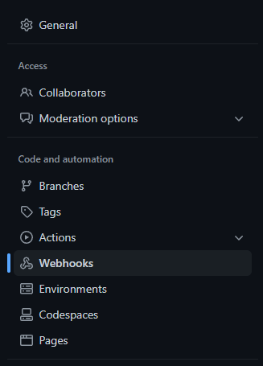
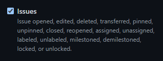

* TOC
{:toc}


In this tutorial, we will setup a receiver for the [`issues`](https://docs.github.com/developers/webhooks-and-events/webhooks/webhook-events-and-payloads#issues) event from Github Webhooks. This will allow you to monitor and analyse activity relating to issues on any of your Github repositories.

You will need your project's master token, and a Github repository in which you have the `Admin` role.

To start ingesting events, you must first create a receiver. Send the following payload to the `https://buffer.keboola.com/v1/receivers` endpoint:
```
{
  "name": "Github Issues",
  "exports": [
    {
      "name": "Events",
      "conditions": {
        "time": "2m"
      },
      "mapping": {
        "tableId": "in.c-github.issues",
        "columns": [
          { "type": "id", "name": "id" },
          { "type": "datetime", "name": "datetime" },
          { "type": "ip", "name": "ip" },
          { "type": "body", "name": "body" },
          { "type": "headers", "name": "headers" },
          {
            "type": "template",
            "name": "template",
            "template": {
              "language": "jsonnet",
              "undefinedValueStrategy": "error",
              "content": "body.issue.body",
            }
          }
        ]
      }
    }
  ]
}
```

You can do this using `curl`, or anything else that allows you to send a HTTP request:
```
$ curl --header 'Content-Type: application/json' \
       --header 'X-StorageApi-Token: <YOUR_TOKEN>' \
       --data '{ ...the payload above... }' \
       https://buffer.keboola.com/v1/receivers
```

Upon success, the response will contain the receiver you've just created:
```
{
  "id": "github-issues",
  "url": "https://buffer.keboola.com/v1/import/<YOUR_PROJECT_ID>/github-issues/<SECRET>"
  "name": "Github Issues",
  "exports": [
    {
      "id": "events",
      "name": "Events",
      "conditions": {
        "count": 1000,
        "size": "1MB",
        "time": "2m"
      },
      "mapping": {
        "tableId": "in.c-github.issues",
        "columns": [
          { "type": "id", "name": "id" },
          { "type": "datetime", "name": "datetime" },
          { "type": "ip", "name": "ip" },
          { "type": "body", "name": "body" },
          { "type": "headers", "name": "headers" },
          {
            "type": "template",
            "name": "template",
            "template": {
              "language": "jsonnet",
              "undefinedValueStrategy": "error",
              "content": "Body.issue.body",
            }
          }
        ]
      }
    }
  ]
}
```

The most important part of the response is the `url` field. This is the endpoint you will point your Github Webhook to. Once you've created the receiver and obtained its `url` field, you are ready to configure the Github Webhook:

Go to the `Settings` tab of your repository.


Open the `Webhooks` page.



Click `Add webhook`.


Enter the receiver `url` into the `Payload URL` field, and set the `Content Type` to `application/json`.


For `Which events would you like to trigger this webhook?`, click `Let me select individual events`, then find `Issues` and tick it:




Click `Add webhook` at the bottom of the page.

Any events related to issues in your repository will now be received by the Buffer API and uploaded to your table.

## Next Steps
- [Events Overview](/integrate/events/overview/)
- [Buffer API Reference](https://buffer.keboola.com/v1/documentation/)
