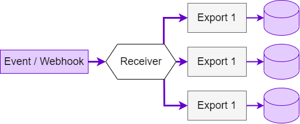

* TOC
{:toc}

A receiver represents an endpoint for receiving events.

Receivers are managed using the Buffer API. The full API reference is available at https://buffer.keboola.com/v1/documentation/, and the OpenAPI specification is available at https://buffer.keboola.com/v1/documentation/openapi3.json.

Events are received using HTTP. Receivers are associated with a maximum of 20 `exports`. Each export represents a `mapping` from event data to `columns` in a destination `table`. Data may be mapped using pre-defined mappings, or a custom `template`.

The available column types are:

|type|description|
|:-|:-|
| `id`| event ID |
| `datetime` | time of the event |
| `ip` | IP of the event sender |
| `body` | the unaltered event body |
| `headers` | the unaltered request headers |
| `template` | a custom mapping using a template language |

The `template` column type currently only supports the `jsonnet` templating language.

The following `jsonnet` globals are available:

|name|description|example|value|
|:-|:-|:-:|:-:|
| `BodyPath` | Get a field from the request body by path | `BodyPath("deeply.nested.path")` | `1000` |
| `Body` | Get the entire request body as an object | `Body()` | `{ "a": "b" }` |
| `Header` | Get the value of a request header | `Header("Content-Type")` | `"application/json"` |
| `Headers` | Get all request headers as an object | `Headers()` | `{ "Content-Type": "application/json" }` |
| `currentDatetime` | Current datetime as a string formatted according to RFC3339 | `currentDatetime` | `"2022-01-02T15:04:05Z01:00"` |

Incoming events are immediately mapped to the schema defined in each export, and each new row is appended to a CSV file. This CSV file is stored in your Keboola project. When certain conditions are met, the data from the file is uploaded to the destination table, and the file is cleared. These `conditions` are defined by the export:

| condition | minimum | maximum | default |
| :- | :-: | :-: | :-: |
| `time` | 30 seconds | 24 hours | 5 minutes |
| `size` | 100 B | 50 MB | 5 MB |
| `count` | 1 | 10 million | 1 thousand |

### Create Receivers and Exports

Receivers may be created using the [`POST /v1/receivers`](https://buffer.keboola.com/v1/documentation/#/configuration/CreateReceiver) endpoint.

If a receiver or export `id` is omitted, it will be generated from the corresponding `name` field.

A receiver may be created without any exports. The exports can then be created separately using the [`POST /v1/receivers/{receiverId}/exports`](https://buffer.keboola.com/v1/documentation/#/configuration/CreateExport) endpoint.

**Warning**: Events sent to a receiver without any exports will be permanently lost. This is because data is buffered per export, not per receiver.

Export tables are created if they do not exist. If they already exist, the schema defined by `export.columns` must match the existing schema. If the table schema is manually altered and it no longer matches, the upload from staging storage to the table will fail. The data is kept in the staging storage for up to 7 days during which you can recover any failures.

### Delete Receivers and Exports

Receivers may be deleted using the [`DELETE /v1/receivers/{receiverId}`](https://buffer.keboola.com/v1/documentation/#/configuration/DeleteReceiver) endpoint. Exports may be deleted using the [`DELETE /v1/receivers/{receiverId}/exports/{exportId}`](https://buffer.keboola.com/v1/documentation/#/configuration/DeleteExport) endpoint.

### Update Receivers and Exports

A receiver may be updated using the [`PATCH /v1/receivers/{receiverId}`](https://buffer.keboola.com/v1/documentation/#/configuration/UpdateReceiver) endpoint. Exports maybe updated using the [`PATCH /v1/receivers/{receiverId}/exports/{exportId}`](https://buffer.keboola.com/v1/documentation/#/configuration/UpdateExport) endpoint.

The `UpdateReceiver` endpoint may only update the receiver's name. Exports may only be updated separately.

If an export's `mapping.tableId` is updated, it is handled the same way as in the create operation. If the table exists, `mapping.columns` must match the existing table's schema. If the table does not exist, it is created.

## Tokens

A token is generated for each receiver export. These tokens have the minimum possible scope, which is a `write` permission for the bucket in which the destination table is stored. You can see these tokens at `https://connection.keboola.com/admin/projects/<project-id>/tokens-settings`. Their description is in the format `[_internal] Buffer Export <export-id> for Receiver <receiver-id>`.

These tokens should not be deleted or refreshed manually. To refresh tokens, use the [`POST /v1/receivers/{receiverId}/tokens/refresh`](https://buffer.keboola.com/v1/documentation/#/configuration/RefreshReceiverTokens) endpoint.

## Next Steps
- [Push Data Tutorial](/integrate/push-data/tutorial/)
- [Buffer API Reference](https://buffer.keboola.com/v1/documentation/)
